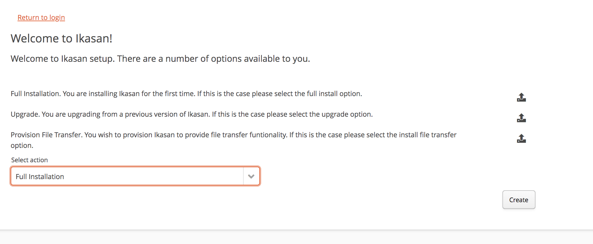
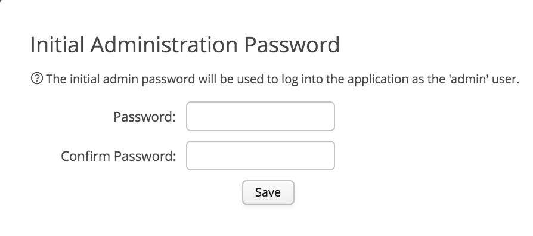
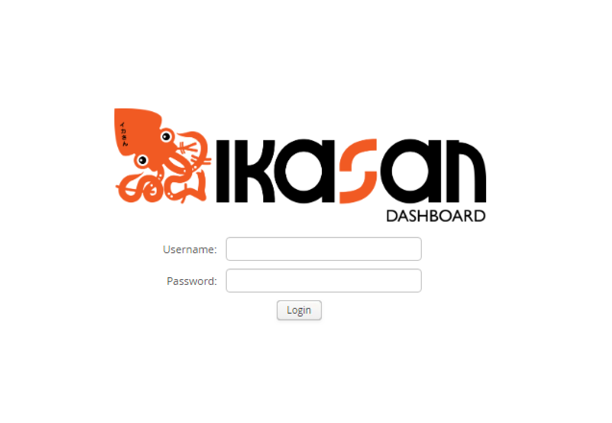
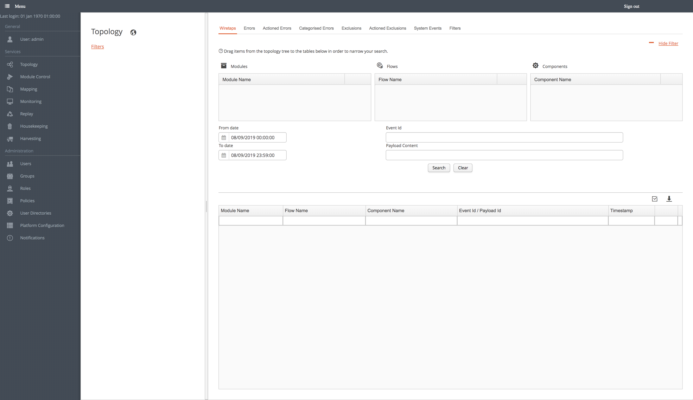

[../](../../Readme.md)

# Dashboard
 
The Ikasan Dashboard provides a management web front end for searching and tracking events passing through Ikasan Integration Modules. Ikasan dashboard functionality covers:
- [Navigating the Dashboard](./MenuNavigation.md)
- [Platform Setup and Maintenance](./PlatformSetup.md)
- [Event Searching and Tracking](./Topology.md)
- [User Administration and Management](./UserAdministration.md)
- [Ikasan Support and Resources](./HousekeepingAndHarvesting.md)
- [Security and Access Management](./SecurityAndAccessManagement.md)
- [Data Mapping](./DataMapping.md)
- [Error and Event Exclusion Lifecycle](./Topology.md)
- [Module control](./TopologyTree.md)
- [Monitoring](./Monitoring.md)
  

## Step-by-step guide how run ikasan-dashboard as standalone 

Download ikasan-dashboard from official mvn repo [ikasan-dashboard-boot/2.1.0](https://oss.sonatype.org/service/local/repositories/snapshots/content/org/ikasan/ikasan-dashboard-boot/2.1.0/)

Start Ikasan-dashboard with h2 in memory database.
- Out of the box ikasan-dashboard is shipped with build in H2 driver which allows you to exlore the product.
- Run           
```
$JAVA_HOME/bin/java -jar ikasan-dashboard-boot-2.1.0.jar
```           

Start ikasan-dashboard with different DB driver              
- download desired driver 
  - sybase [jconn4-7.0.jar](http://mvn.sonner.com.br/~maven/com/sybase/jdbc4/jdbc/jconn4/7.0/jconn4-7.0.jar)
  - sql [mssql-jdbc-6.2.1.jre8.jar](http://central.maven.org/maven2/com/microsoft/sqlserver/mssql-jdbc/6.2.1.jre8/mssql-jdbc-6.2.1.jre8.jar)
  - mysql [mysql-connector-java-5.1.44.jar](http://central.maven.org/maven2/mysql/mysql-connector-java/5.1.44/mysql-connector-java-5.1.44.jar)  
- create sub dir lib, and place new driver in lib        
- create sub dir config
- create new config/application.properties file based on [application.properties](boot/src/main/resources/application.properties)
   - Sybase 
```
datasource.username=ikasan01xxx
datasource.password=XXXXXXXXXXXXXXXXXXXXXXX
datasource.driver-class-name=com.sybase.jdbc4.jdbc.SybDataSource
datasource.xadriver-class-name=com.sybase.jdbc4.jdbc.SybXADataSource
datasource.dialect=org.ikasan.persistence.hibernate.IkasanSybaseASE157Dialect
datasource.url=jdbc:sybase:Tds:hostname:50100/Ikasan01
datasource.db.name=Ikasan01
datasource.port=50100
datasource.host=hostname
```         
   - mssql   
```
datasource.username=ikasan01xxx
datasource.password=XXXXXXXXXXXXXXXXXXXXXXX
datasource.dialect=org.hibernate.dialect.SQLServer2012Dialect
datasource.driver-class-name=com.microsoft.sqlserver.jdbc.SQLServerDriver
datasource.xa-driver-class-name=com.microsoft.sqlserver.jdbc.SQLServerXADataSource 
datasource.url=jdbc:sybase:Tds:hostname:50100/Ikasan01
datasource.db.name=Ikasan01
datasource.port=50100
datasource.host=hostname
```                          
- Start dashboard with custom driver 
```
$JAVA_HOME/bin/java -Dloader.path=lib,config -jar ikasan-dashboard-boot-2.1.0.jar

```    

Navigate to Frontend [http://localhost:9980/ikasan-dashboard](http://localhost:9980/ikasan-dashboard)

In order to setup the ikasan dashboard for the first time navigate to [http://localhost:9980/ikasan-dashboard/#!persistanceSetupView](http://localhost:9980/ikasan-dashboard/#!persistanceSetupView) 

You will be presented with a screen.


- Select "Full Installation" from the action drop down.
- Press the create button.

You will be presented with a dialog that prompts the the admin password that will be created.


- Enter the admin password that you wish to use. Press save.
- A notification will appear to state that the database has been created successfully. Click on the return to login link in the top left corner.

You will return to the login screen. 



- Enter the user name as 'admin' along with the password created in the previous step.

When you have logged in successfully, you will be presented with the following screen.




- you can modify binding IP, port and application context in  [application.properties](boot/src/main/resources/application.properties)
```
server.port=8080
server.address=0.0.0.0
server.servlet.context-path=/ikasan-dashboard
```      


