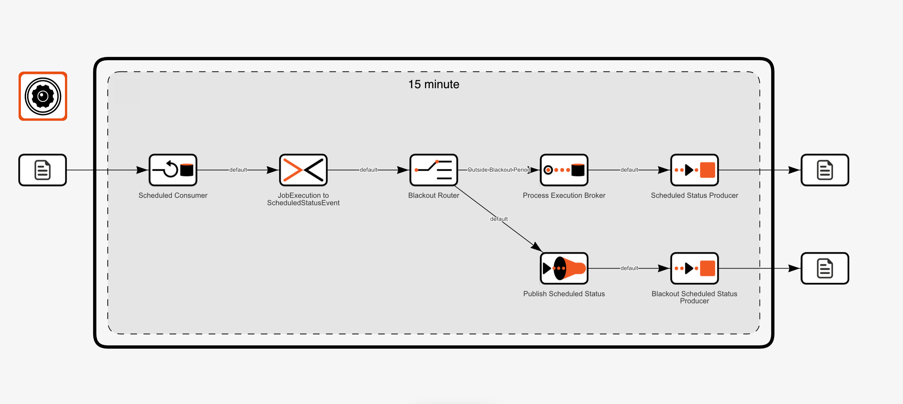
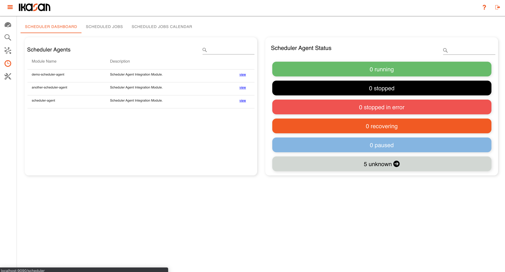

# Scheduler Agent Design

Each scheduled job managed within the Ikasan ESB employs a template flow. The consumer in the flow fires according to what ever [Quartz](http://www.quartz-scheduler.org/) cron expression is configured for the job. There is a router to determine if the job falls in a blackout window and a broker to execute the job along with endpoints to publish the execution status of the job. Scheduled jobs are configured and managed from within the [Ikasan Dashboard](../../../visualisation/dashboard/scheduler.md). 
                                                                           


## Deploying a Scheduler Agent
All Ikasan binaries are available for download at [Maven Central](https://search.maven.org/search?q=org.ikasan)

1. In order to deploy a scheduler agent search for scheduler-agent-distribution and download the desired version which is bundled as a zip file. Unzip the file to the install location

The contents of the zip file is as follows.

| Filename | Description  |
| ---  | --- |
| simple-env.sh | Unix/Linux environment file in which environment variables required by the agent can be set. |
| simple-env.bat | Windows environment file in which environment variables required by the agent can be set. |
| config-service-env.bat | Windows environment file in which environment variables required by the agent can be set when running the agent in combination with [Spring Cloud Config](https://cloud.spring.io/spring-cloud-config/reference/html/). |
| config-service-env.sh | Unix/Linux environment file in which environment variables required by the agent can be set when running the agent in combination with [Spring Cloud Config](https://cloud.spring.io/spring-cloud-config/reference/html/). |
| ikasan-config-service.bat | Windows bat file that allows the agent to be started and stopped in a Windows environment when using [Spring Cloud Config](https://cloud.spring.io/spring-cloud-config/reference/html/). |
| ikasan-config-service.sh | Shell script that allows the agent to be started and stopped in a Unix/Linux environment when using [Spring Cloud Config](https://cloud.spring.io/spring-cloud-config/reference/html/). |
| ikasan-simple.bat  | Windows bat file that allows the agent to be started and stopped in a Windows environment. |
| ikasan-simple.sh  | Shell script that allows the agent to be started and stopped in a Unix/Linux environment |
| config/logback-spring.xml | Logging configuration file |
| config/application.properties | Scheduler agent properties file |
| lib/scheduler-agent-3.2.0.jar | Uber jar containing all libraries required by the scheduler agent | 
| lib/h2-1.4.200.jar | H2 database libraries used by the agent |
| lib/ikasan-shell-3.2.0.jar | The [Ikasan cli shell library](../../../cli/shell/jar/Readme.md) |

2. Add the JAVA_HOME to the relevant environment file. Please note JDK11 is required.
```properties
#!/bin/bash

# Use this to set any environment properties for the ikasan-simple.sh shell
JAVA_HOME=/opt/platform/jdk-11.0.6+10
```
3. Update the `config/application.properties` to bind to desired host and ports. Provide the correct url for the Ikasan Dashboard and suitable credentials for an Ikasan admin account.
```properties
# Web Bindings
h2.db.port=8082
server.port=8080
server.address=localhost
.
.
.
# Dashboard data extraction settings
ikasan.dashboard.extract.enabled=false
ikasan.dashboard.extract.base.url=http://localhost:9080/ikasan-dashboard
ikasan.dashboard.extract.username=
ikasan.dashboard.extract.password=
```
4. Start the scheduler agent.
```bash
./ikasan-simple.sh start
```
5. Log into the Ikasan Dashboard to confirm that the agent has registered itself with the dashboard.



6. Once successfully registered it is possible to begin to create new [scheduled jobs](../../../visualisation/dashboard/scheduler.md).


                                                                            

